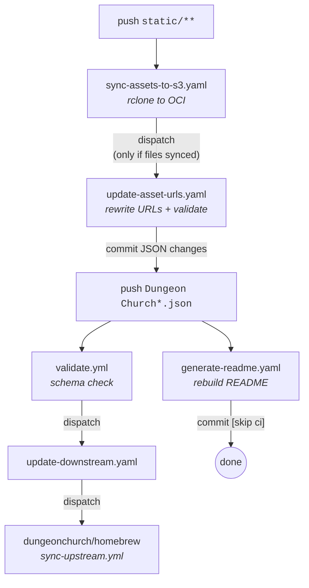

# CI/CD Workflows

## Flow

## Workflows

### `validate.yml`
**Triggers:** push or PR touching `Dungeon Church*.json`

Validates all homebrew JSON files against the 5eTools schema. On push to `main`, dispatches `update-downstream.yaml` to sync the downstream homebrew repo.

### `generate-readme.yaml`
**Triggers:** push to `main` touching `Dungeon Church*.json` or the generator script

Regenerates the Pyora Setting section of `README.md` from the JSON data. Commits with `[skip ci]` to stop the chain.

### `sync-assets-to-s3.yaml`
**Triggers:** push to `main` touching `static/**`

Syncs the `static/` folder to OCI Object Storage using rclone. If files were actually transferred, dispatches `update-asset-urls.yaml`.

### `update-asset-urls.yaml`
**Triggers:** dispatched by `sync-assets-to-s3.yaml`

Runs `migrate_assets.py` to replace old asset URLs (GitHub raw, etc.) with OCI Object Storage URLs in the JSON files. Validates the JSON, then commits. The commit intentionally omits `[skip ci]` so the JSON push flow kicks in.

### `update-downstream.yaml`
**Triggers:** dispatched by `validate.yml`

Dispatches `sync-upstream.yml` in `dungeonchurch/homebrew` so the downstream repo picks up the latest JSON.
